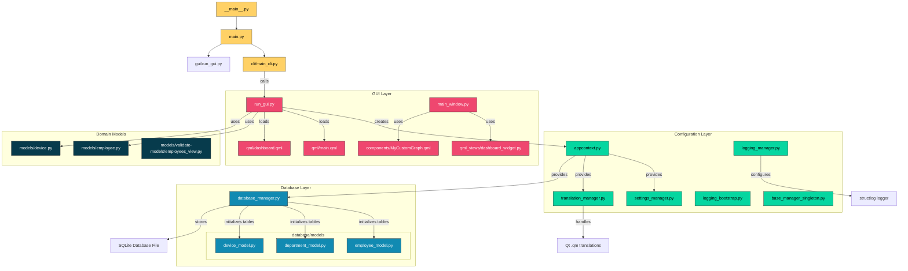

## JM BDE Architecture

```mermaid
flowchart TD
    %% === Entry Points ===
    A[__main__.py] --> B[main.py]
    B --> C[cli/main_cli.py]
    B --> D[gui/run_gui.py]

    %% === Configuration ===
    subgraph Config["Configuration Layer"]
        E1[appcontext.py]
        E2[settings_manager.py]
        E3[translation_manager.py]
        E4[logging_manager.py]
        E5[logging_bootstrap.py]
        E6[base_manager_singleton.py]
    end

    %% === Database Layer ===
    subgraph DB["Database Layer"]
        F1[database_manager.py]
        subgraph Models["database/models"]
            F2[employee_model.py]
            F3[department_model.py]
            F4[device_model.py]
        end
    end

    %% === GUI Layer ===
    subgraph GUI["GUI Layer"]
        G1[run_gui.py]
        G2[main_window.py]
        G3[qml/main.qml]
        G4[qml/dashboard.qml]
        G5[qml_views/dashboard_widget.py]
        G6[components/MyCustomGraph.qml]
    end

    %% === Domain Models ===
    subgraph ModelsRoot["Domain Models"]
        H1[models/employee.py]
        H2[models/device.py]
        H3[models/validate-models/employees_view.py]
    end

    %% === Core Application Relationships ===
    C -->|calls| G1
    G1 -->|creates| E1
    E1 -->|provides| E2 & E3 & F1
    F1 -->|initializes tables| F2 & F3 & F4
    G1 -->|loads| G3 & G4
    G2 -->|uses| G5 & G6
    G1 -->|uses| H1 & H2

    %% === External Links ===
    E4 -->|configures| log["structlog logger"]
    E3 -->|handles| tr["Qt .qm translations"]
    F1 -->|stores| sqlite["SQLite Database File"]

    %% === Decorations ===
    classDef entry fill:#ffd166,stroke:#555,stroke-width:1px,color:#000;
    classDef config fill:#06d6a0,stroke:#333,stroke-width:1px,color:#000;
    classDef db fill:#118ab2,stroke:#333,stroke-width:1px,color:#fff;
    classDef gui fill:#ef476f,stroke:#333,stroke-width:1px,color:#fff;
    classDef model fill:#073b4c,stroke:#333,stroke-width:1px,color:#fff;

    class A,B,C entry;
    class E1,E2,E3,E4,E5,E6 config;
    class F1,F2,F3,F4 db;
    class G1,G2,G3,G4,G5,G6 gui;
    class H1,H2,H3 model;
```
